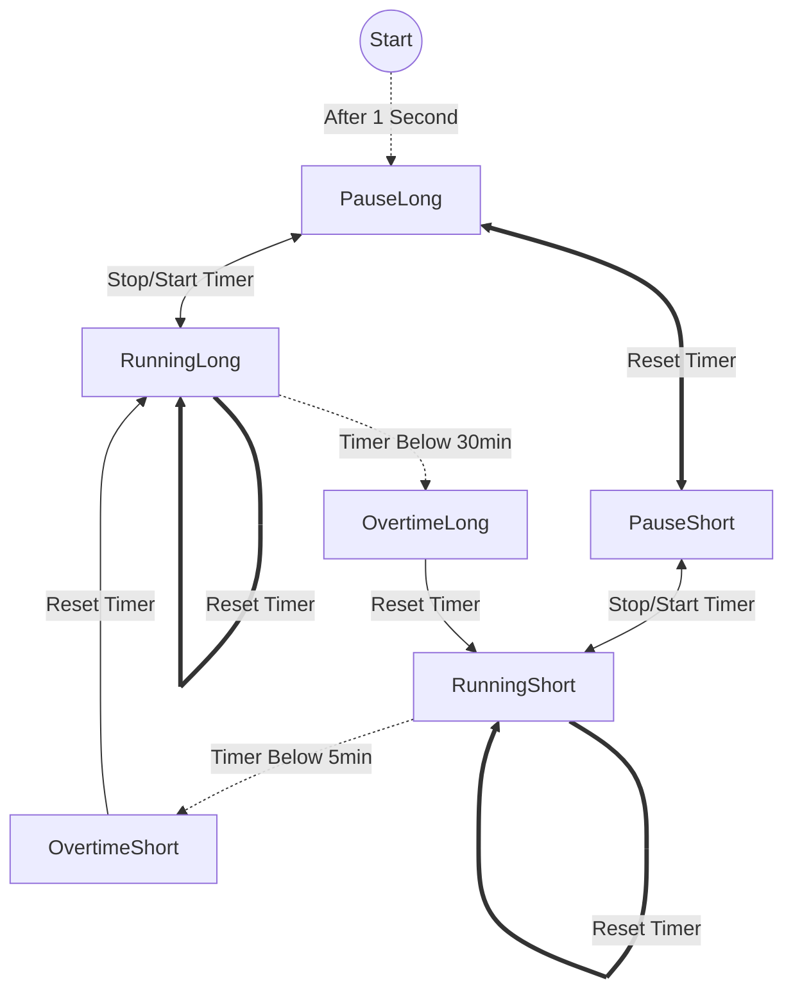

# Pomodoro-Timer
A simple Pomodoro Timer that switches between 5 min and 30 min intervals. The timer is modeled roughly after a [finite-state machine](https://en.wikipedia.org/wiki/Finite-state_machine):

The normal lines repesent a single button push, the thick line a double button push, and the dotted line an timer event.

The graph is not a perfect repesentation of a finite-state machine as the state of the timer state is ignored. 
The states are a comination of the labels Long & Short and Pause, Running, & Overtime. Long and Short indicate that the timer is in the 30min and 5min interval, respectively. In the Pause state the timer does nothing, while in the Running state the timer counts down. If the timer reaches the 30min or 5min mark it switches into the Overtime state. To include the timer interaction we added text above each edge to state the interaction with the timer:

# Future Plans
- [ ] Create a real finite-state machine.
  - [ ] Add timer as state as well
- [ ] Export Counter into seperate file
- [ ] Button has to be glued in, fix this in the CAD Model
- [ ] Instead of using a loop to check for the button state, use an interrupt
  - [ ] Implement an debouncing circuit (just an condensator)
- [ ] The Arduino Lib has an event every 1millisecond (cite?), instead of using the arduino libirary we can use the timer register directly, and thus, the arduino would at sleep until the display refreshes to save power (https://ww1.microchip.com/downloads/aemDocuments/documents/MCU32/ProductDocuments/DataSheets/SAM-D21-DA1-Family-Data-Sheet-DS40001882H.pdf)
